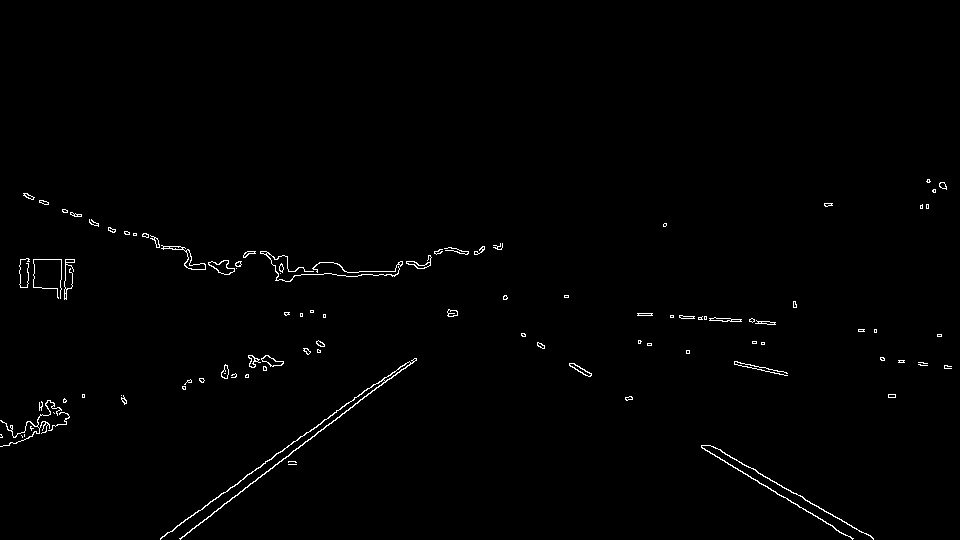

# **Finding Lane Lines on the Road** 

The goal of this project is to find the lane lines in videos captured by a camera placed in the front of a car by using 
classical Computer Vision algorithms. The original repository is [CarND-LaneLines-P1 (Udacity)](https://github.com/udacity/CarND-LaneLines-P1)

---

### Reflection

### 1. Describe your pipeline. As part of the description, explain how you modified the draw_lines() function.

My pipeline consisted of 6 steps.  
1. I applied 2 color filters that return two masks corresponding to 2 colors of lane lines in videos: white and yellow.  

2. I converted the images to grayscale.  

3. I smoothed the gray image by using a Gaussian filter with a kernel size of 5.  

4. I used the Canny algorithm to detect edges in the blurred image with the parameters: low_threshold=50, high_threshold=150.

5. I defined four vertices in the image, then use cv2.fillPoly() function to find the RoI bounded by the defined vertices.  
6. I used the Hough transform algorithm to detect lines.  

In order to draw a single line on the left and right lanes, I add a new function *draw_lines_extrapolate()*. 
This task included 5 steps:
1. I separated points in detected lines to the left lane and the right lane by considering the slope values between two points in a line.  
    - If *(x1 == x2)* ~ a vertical line, I set the *slope = 1e9*
    - If the slope of a line between 2 points is negative, the 2 points were placed in the left lane.   
    - If the slope of a line between 2 points is positive, the 2 points were placed in the right lane.   
   The slope was rounded with 2 digits, then multiply to 100, and added to the *left_slopes* and *right_slopes* lists.
2. The slope with the highest frequency in each slopes list was considered as the standard slope of the lane line.
3. If a point has a slope that is out of the accepted range of slopes, I removed it. After this step, I obtained the 2 
clean sets of points on the left and right lane lines. 
4. Using cv2.fitLine() to find the line parameters for the two lane lines based on the clean sets of points.
5. I calculated the two endpoints *(x1, y1)* and *(x2, y2)* of each lane line with a convention that: *y1 = height-1.*  

Video results:
1. White Lane detection: [https://youtu.be/BVatQbo-OSw](https://youtu.be/BVatQbo-OSw)
2. Yellow Lane detection: [https://youtu.be/IwYz8S9-vyY](https://youtu.be/IwYz8S9-vyY)
3. Challenge video: [https://youtu.be/CChspbNZw9I](https://youtu.be/CChspbNZw9I)

### 2. Identify potential shortcomings with your current pipeline
There are several disadvantages to this approach.
- First, one potential shortcoming would be what would happen when the lane lines are colored by non-white and non-yellow color,
or the car is driving at night.
We need to control the threshold in the *cv2.inRange()* function.

- Second, the current pipeline may not work well in a scene that has many curves.

- Third (Finally), another shortcoming could be related to the camera position. In the project, I played with videos mounted on the front of 
the car. If the camera is located in other positions, I need to change the vertices in the fifth step.

### 3. Suggest possible improvements to your pipeline
A possible improvement would be to detect more complex models based on edges that are from the Canny algorithm.